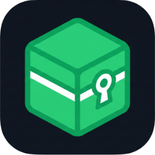

<div align="center">
  
  <h1>LiteVault</h1>
  <p><strong>The ultimate personal manager and 3D viewer for your Litematica schematics.</strong></p>
  <p><strong>El gestor personal y visor 3D definitivo para tus schematics de Litematica.</strong></p>
  
  <p>
    <a href="#-english">🇺🇸 English</a> •
    <a href="#-español">🇪🇸 Español</a>
  </p>
</div>

<br/>

---

## 🇺🇸 English

### ✨ Features
- 📦 **Secure Local Management**: Organize all your `.litematic` files into custom categories, with tags and an instant search engine.
- 🧊 **Integrated 3D Viewer**: Preview your builds directly in the application thanks to the *Three.js* engine and *Litematica-viewer*, without needing to open Minecraft.
- 🤖 **Automatic Metadata Extraction**: Automatically extracts block lists, dimensions, author name, and creation date for each schematic.
- 💬 **Discord Sync**: Configure a bot to read a Discord channel and automatically download schematics shared by your friends.
- 🎨 **Modern Design**: Premium "Glassmorphism" style interface with a dark theme—fast, sleek, and intuitive.
- 🔄 **Automatic Updates**: The program automatically detects new versions on GitHub and updates itself with a single click.

### 🚀 Installation & Download (For Users)

1. Go to the **[Releases](../../releases/latest)** tab on the right side of this repository.
2. Download the latest `LiteVault_Setup_vX.X.X.exe` file.
3. Run it, follow the installer steps, and you're done!

> **Note:** The application is entirely portable; your database and files are safely stored in your personal Documents folder.

### 🛠️ Development Environment (For Developers)

If you are a developer and want to modify the LiteVault source code or compile it yourself:

**Requirements:**
- **Python 3.11+**
- **Inno Setup** (Only if you want to generate the final installer `.exe`)

**Setup Environment:**
```bash
git clone https://github.com/Aosiika/LiteVault.git
cd LiteVault
python -m venv .venv
.venv\Scripts\activate   # On Windows
pip install -r requirements.txt
```

**Run in Development Mode:**
```bash
python app/main.py
```

**Compile Executable (PyInstaller):**
```bash
pyinstaller build.spec --clean -y
```

---

## 🇪🇸 Español

### ✨ Características
- 📦 **Gestión Local Segura**: Organiza todos tus `.litematic` en categorías personalizadas, con etiquetas y un buscador instantáneo.
- 🧊 **Visor 3D Integrado**: Previsualiza tus construcciones directamente en la aplicación gracias al motor *Three.js* y *Litematica-viewer*, sin necesidad de abrir Minecraft.
- 🤖 **Extracción Automática de Metadatos**: Extrae lista de bloques, dimensiones, nombre del autor y fecha de creación de cada schematic automáticamente.
- 💬 **Sincronización con Discord**: Configura un bot para que lea un canal de Discord y se descargue automáticamente los schematics que compartan tus amigos.
- 🎨 **Diseño Moderno**: Interfaz premium estilo "Glassmorphism" con tema oscuro, muy rápida e intuitiva.
- 🔄 **Actualizaciones Automáticas**: El programa detecta automáticamente las nuevas versiones de GitHub y se actualiza con un solo clic.

### 🚀 Instalación y Descarga (Para Usuarios)

1. Ve a la pestaña de **[Releases](../../releases/latest)** en la parte derecha de este repositorio.
2. Descarga el último archivo `LiteVault_Setup_vX.X.X.exe`.
3. Ejecútalo, sigue los pasos del instalador y ¡listo!

> **Nota:** La aplicación es totalmente portable; tu base de datos y tus archivos se guardan de forma segura en tu carpeta personal de documentos.

### 🛠️ Entorno de Desarrollo (Para Desarrolladores)

Si eres desarrollador y quieres modificar el código de LiteVault o compilarlo tú mismo:

**Requisitos:**
- **Python 3.11+**
- **Inno Setup** (Solo si quieres generar el `.exe` final)

**Instalación del entorno:**
```bash
git clone https://github.com/Aosiika/LiteVault.git
cd LiteVault
python -m venv .venv
.venv\Scripts\activate   # En Windows
pip install -r requirements.txt
```

**Ejecutar en modo desarrollo:**
```bash
python app/main.py
```

**Compilar el Ejecutable (PyInstaller):**
```bash
pyinstaller build.spec --clean -y
```

---

## 📚 Technologies / Tecnologías
Este proyecto es de código abierto y ha sido posible gracias al trabajo increíble de la comunidad / *This project is open-source and has been made possible thanks to the amazing work of the community*:
- **[Python](https://www.python.org/)** & **[NiceGUI](https://nicegui.io/)**: Backend and UI framework.
- **[SQLite](https://www.sqlite.org/)** & **[SQLModel](https://sqlmodel.tiangolo.com/)**: Fast, lightweight local database.
- **[maruohon/litematica](https://github.com/maruohon/litematica)**: Creator of the original `.litematic` format.
- **[albertchen857/Litematica-viewer](https://github.com/albertchen857/Litematica-viewer)**: Core javascript library to decrypt and parse Litematica files.
- **[schematic-renderer](https://github.com/vberlier/schematic-renderer)**: Web rendering engine based on Three.js.

## ⚖️ Legal Disclaimer / Aviso Legal
**LiteVault is a non-commercial open-source project.**
We are not affiliated, associated, authorized, endorsed by, or in any way officially connected with **Mojang AB** or **Microsoft Corporation**. The name "Minecraft" and game assets are registered trademarks of Mojang AB.

**LiteVault es un proyecto de código abierto no comercial.** 
No estamos afiliados, asociados, autorizados, respaldados ni conectados oficialmente de ninguna manera con **Mojang AB** ni con **Microsoft Corporation**. El nombre "Minecraft" y los recursos del juego son marcas registradas de Mojang AB. 

---
<div align="center">
Developed with ❤️ by <b>Aosika</b> | 2026
</div>
